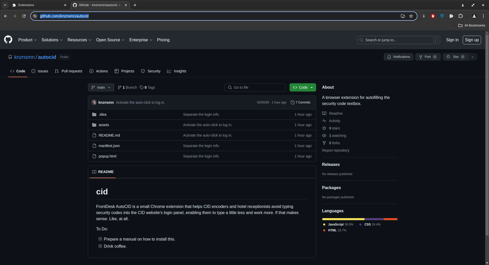
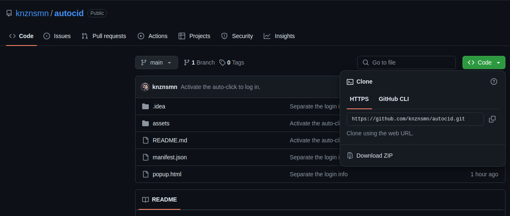
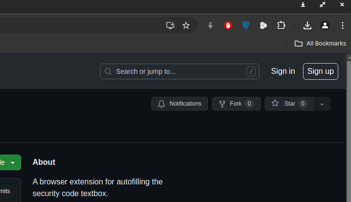
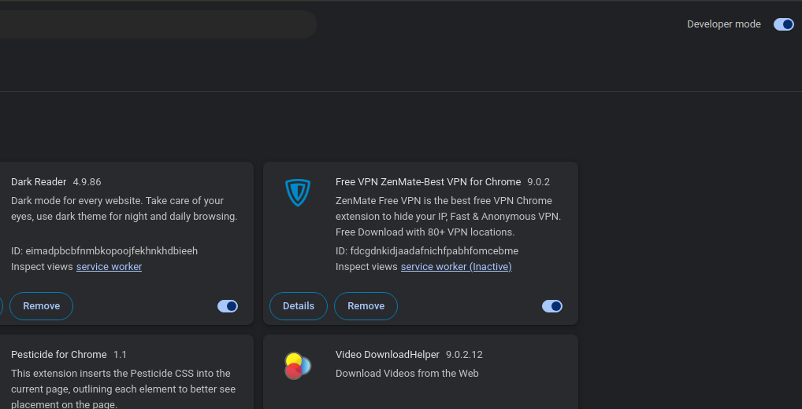
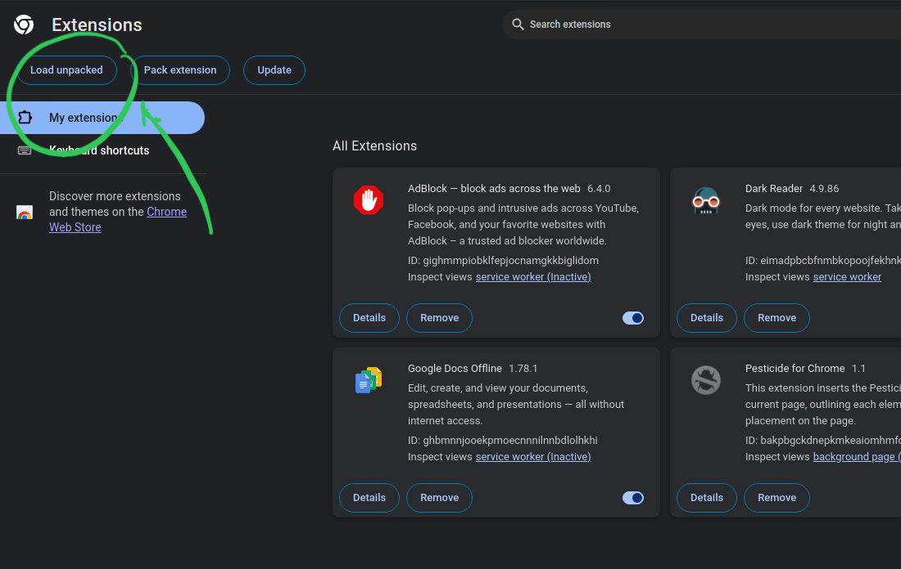

# FrontDesk AutoCID
 
The FrontDesk AutoCID Chrome extension assists CID encoders and hotel receptionists by automatically entering security codes into the CID website's login panel. This helps reduce the amount of typing required, allowing them to work more efficiently. If that makes sense. Like, at all.

## How to Install:
1. Go to the [repository](https://github.com/knznsmn/autocid). 
2. Download the repository. 

3. (Optional) Extract the downloaded zip file to a convenient location. 
4. Open [chrome://extensions/](chrome://extensions/). 
5. Enable Developer Mode and load the downloaded extension by clicking on the "Load unpacked" button on the top right.

6. You will now find **FrontDesk AutoCID** among your installed extensions. Consider pinning it for easy access. 
7. Click the extension icon to open the login panel and save your login details.

## To Use:
1. Save your login details by clicking on the **FrontDesk AutoCID** icon in the toolbar. 
2. Autologin will work after saving your username and password. This only needs to be done once. 
3. Click anywhere on the login panel or press the `Enter` key to activate the auto-login function. 
4. That's it!

To Do:

- [ ] Prepare a manual on how to install this.
- [ ] Drink some coffee.
